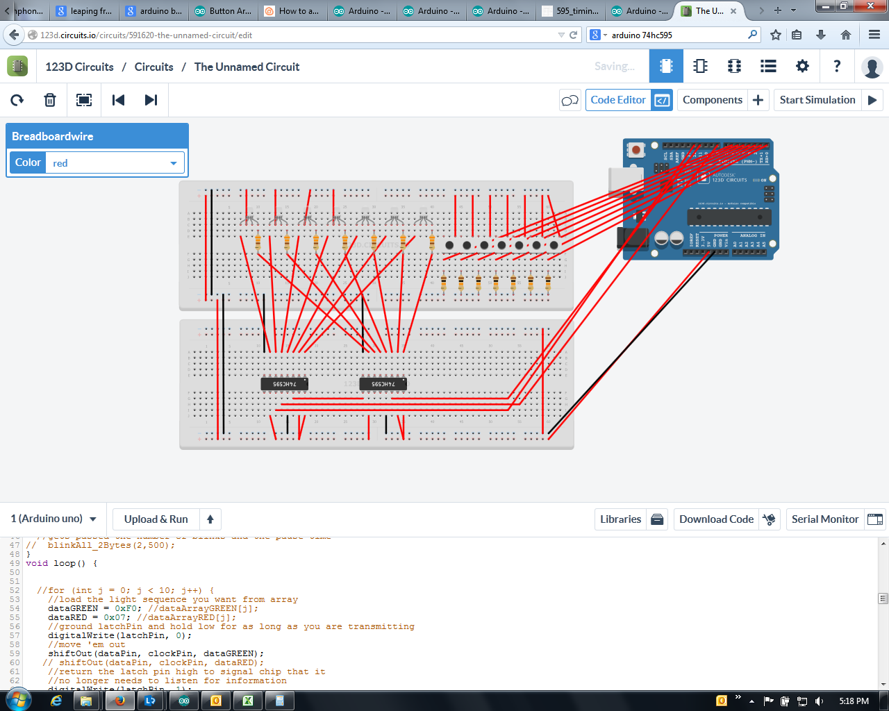
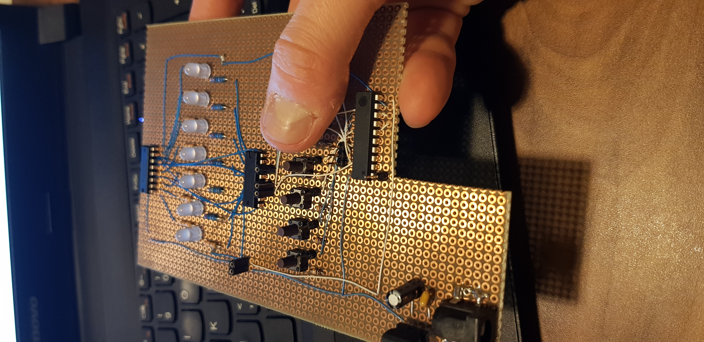
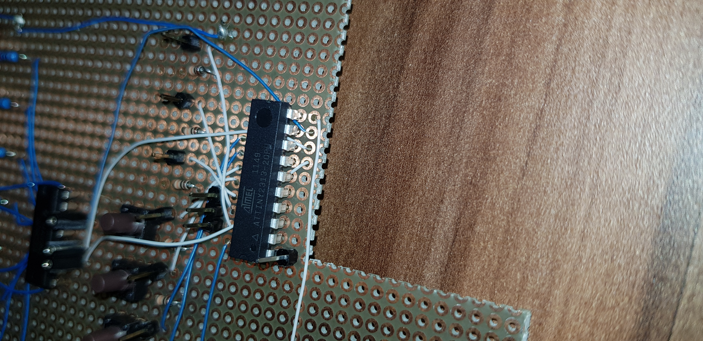
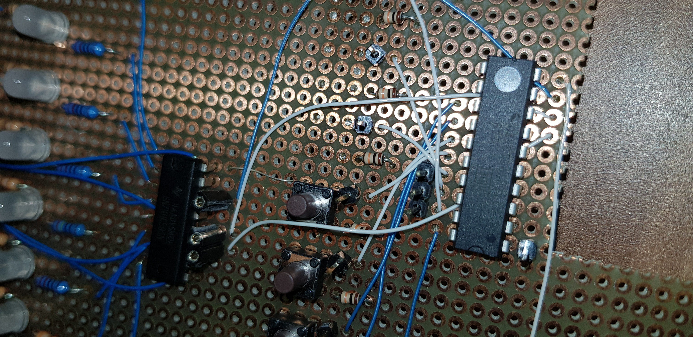
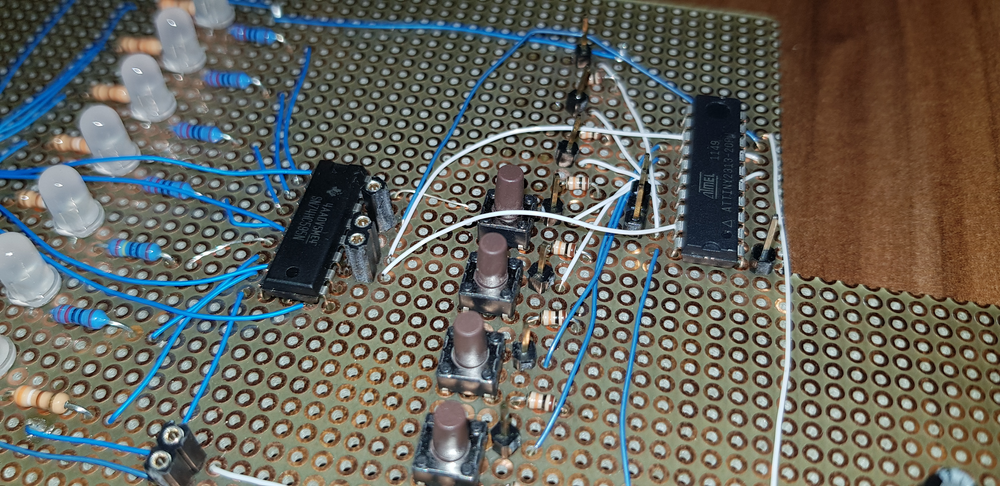

# leap-frogs
Leap frogs puzzle using ATTiny2313, LEDs and 2x 74HC595

Link to video of game demonstration here https://www.youtube.com/watch?v=efiNuF72teI
If you want to play the game, try this link - https://primefactorisation.com/frogpuzzle/
Three buttons are missing because I used them for rc-car remote control. :)

